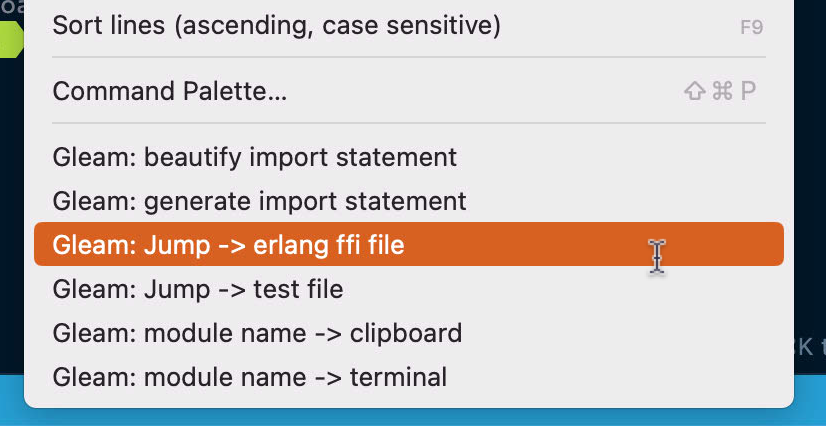

# Gleam QOL

This extention improve QOL of programming with Gleam language.

Add some useful context menus to .gleam, .erl as shown in the screenshot.

## Tested Environment

- Intel Mac OS Sonoma 14.1.2, Erlang/OTP 26, gleam 0.33.0-rc1
- M1 Mac OS Sonoma 14.1.2, Erlang/OTP 26, gleam 0.33.0-rc1
- Ubuntu 22.04, Erlang/OTP 26, gleam 0.33.0-rc1
